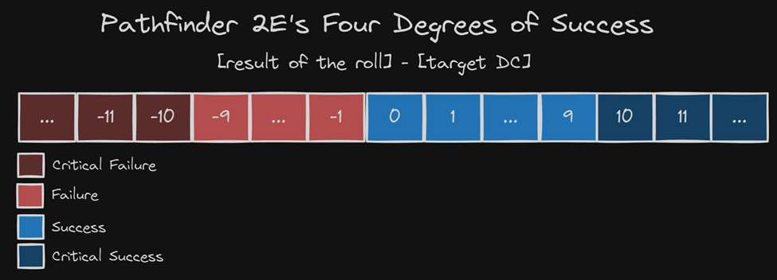

# PathFinder 2E - DiceRoll WebApp

This is a WebApp that checks odds for a D20 RPG Dice and returns those odds based on
Pathfinder 2E rules that configures as Four Degrees of Succes:

## Technologies

- ViteJS - Build tool for modern web projects.

- Typescript - superset for JavaScript. Typed programming language built on JS.

- Node.js - JavaScript runtime environment.

## Installation

1. Clone repository:
  git clone https://github.com/felipezoltowski/hp-webapp-test.git

2. Navigate into project directory:
  cd web-app

3. Install dependencies
  npm install

4. Build the docker image
  docker build -t web-app . 

5. Run the docker image
  docker run -p 5173:80 web-app

6. On your browser, access:
  http://localhost:5173:80

## Usage
  If you want to run in it locally, you can simply run:
    npm run dev

  after the initial npm install
